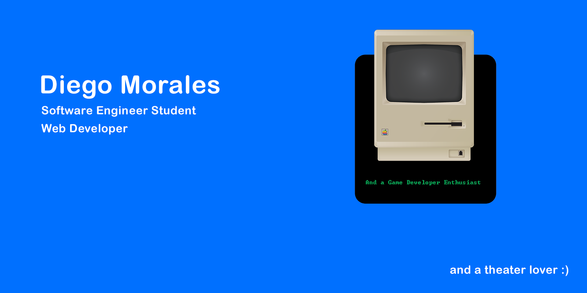

### Hi there, I am Diego

## Developer and student
- I'm currently working on several Web projects
- I'm looking to collaborate with other content creators
- I'm learning about Web Design
- Facts: I love art!

### Web

### Platforms

### General

### Databases

### Others

